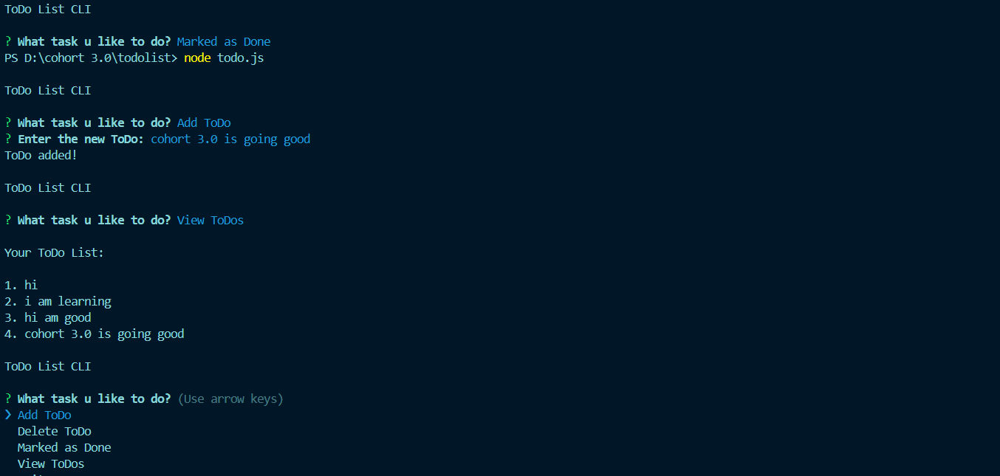

# ToDo List CLI - Cohort 3.0 Week 3 Assignment 2

This project is a simple command-line ToDo list application created as part of **Cohort 3.0 Week 3 Assignment 2**. The application allows users to manage a list of tasks stored in a local file (`todos.json`). The tool provides basic functionalities like adding a task, marking tasks as done, and deleting tasks.

## Features

- **Add ToDo:** Add a new task to the list.
- **Delete ToDo:** Remove a task from the list.
- **Mark As Done:** Mark a task as completed.
- **View ToDos:** View all the tasks in the list with their current status.

## Technologies Used

- **Node.js**
- **Inquirer.js** (for interactive CLI)
- **File System (fs)** (for saving and loading tasks to `todos.json`)

## Prerequisites

Before running this project, ensure you have the following installed:

- **Node.js** (v14 or higher)
- **NPM** (Node Package Manager)

## Setup Instructions

1. Clone or download the repository to your local machine.
   
2. Navigate to the project folder:

    ```bash
    cd <your-project-folder>
    ```

3. Install the required packages:

    ```bash
    npm install
    ```

4. Run the application:

    ```bash
    node todo.js
    ```

## How to Use

After running `node todo.js`, you'll be presented with a simple menu to perform different actions on your ToDo list. Choose an option using arrow keys and hit `Enter`.

1. **Add ToDo** - Enter a new task.
2. **Delete ToDo** - Select a task to delete.
3. **Mark As Done** - Select a task to mark as done.
4. **View ToDos** - View all your tasks, with completed tasks marked as `(Done)`.
5. **Exit** - Close the application.

## File Structure

- **todo.js**: The main script for the ToDo CLI.
- **todos.json**: A JSON file that stores all the ToDo tasks.

## Example:-

